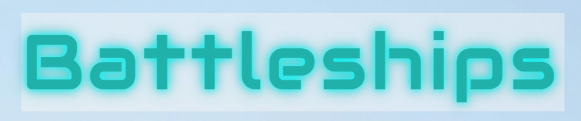

# battleship-browser-game

Game Name: Battleships Browser Game

Description:
Battleships is a digital version of the classic two-player strategy game where you face off against one another but in this version you play against a computer opponent. Both you and the computer place ships on a hidden grid and take turns guessing the locations of each other's ships. The objective is to be the first to sink all of the enemy's ships.

Background:
I chose to recreate Battleships because it was one of my favourite childhood games. I used to play it a lot with my brother, and building a version where you can play against a computer felt like a fun way to combine nostalgia with a programming challenge.

Links:
- Planning Material: https://drive.google.com/drive/folders/1FGfibLE0UW7hNKV0kuZIt_NV7d9aeSgp?usp=sharing
  - The wireframes include the pseudocode for each section of the game. I used images to make it easier to understand. 
- Deployed game : https://bronteda.github.io/battleship-browser-game/

Attributions:

Google Fonts:
- Audiowide: https://fonts.google.com/specimen/Audiowide
- Poiret One: https://fonts.google.com/specimen/Poiret+One

Confetti Animation:
- canvas-confetti library (by catdad)
  - CDN link used: https://cdn.jsdelivr.net/npm/canvas-confetti@1.6.0/dist/confetti.browser.min.js
  - GitHub: https://github.com/catdad/canvas-confetti

Background Image:
- I downloaded the image from : https://www.metoffice.gov.uk/research/approach/modelling-systems/ocean-models

Technologies Used:
- HTML5
- CSS3
- JavaScript 
- Google Fonts
- Canvas Confetti

Future Plans:
- Improve Computer side: Enhance the computer opponent to make more strategic moves instead of relying on random guesses.

- Visual Ship Placement: Replace placeholder visuals with actual ship images and allow users to drag and place ships on the board.

- Display Computer Board: Show the computer's grid (with hidden ships) during gameplay to improve clarity and user experience.

- Multiplayer Mode: Add an option for two players to play against each other locally or online.

- Difficulty Levels: Introduce different difficulty settings for the computer opponent (e.g., Easy, Medium, Hard).

- Sound Effects: Implement sound effects for actions like hitting a ship, missing, or sinking a ship to make the game more immersive.

- Game Statistics: Add a section to display stats after the game, such as hit accuracy, number of turns taken, etc.

- Mobile Responsiveness: Ensure the game works seamlessly across different screen sizes and devices, especially on mobile phones.

- Game Save/Resume Feature: Allow players to save their progress and resume the game later.

What I learned:
- Math.floor - Rounds a number down to nearest whole number
We can use this JS function to get the row number. If we have a grid and we need to ensure that something is not placed on a different row. We can use this function to stop that. 
You need width and index in order to calculate row.
width=10
index=23
row = Math.floor(index/width) - row 2

- Set - is a special list that only stores unique values (no duplicates allowed) and faster when you want to check something is in a list. 
example:
const mySet = new Set();

mySet.add(3); // adds 3
mySet.add(3); // does nothing because 3 is already in the set

console.log(mySet.has(3)); // true
console.log(mySet.has(5)); // false

- Do..While loop 
The do...while loop is a control structure that runs the block of code once first, and then keeps running it as long as a condition is true. It's useful when you want to guarantee that the code inside runs at least once, even if the condition is false the first time.
example :
let number;

do {
  number = Math.floor(Math.random() * 10);
  console.log("Picked:", number);
} while (number !== 5);

- Object.values(ships)
This takes the object ships (e.g., playerShips or computerShips) and returns an array of all the ship arrays.
ships 
before:
{
  ship1: [{ cellNumber: 3, hit: true }, { cellNumber: 4, hit: true }],
  ship2: [{ cellNumber: 10, hit: true }, { cellNumber: 11, hit: false }]
}

after: gives us an array we can loop through 
{
  ship1: [{ cellNumber: 3, hit: true }, { cellNumber: 4, hit: true }],
  ship2: [{ cellNumber: 10, hit: true }, { cellNumber: 11, hit: false }]
}

- object.keys - This looks at the key values of an obejct 
Object.keys(ships).forEach(shipType => {
        ships[shipType] = [];
    });
